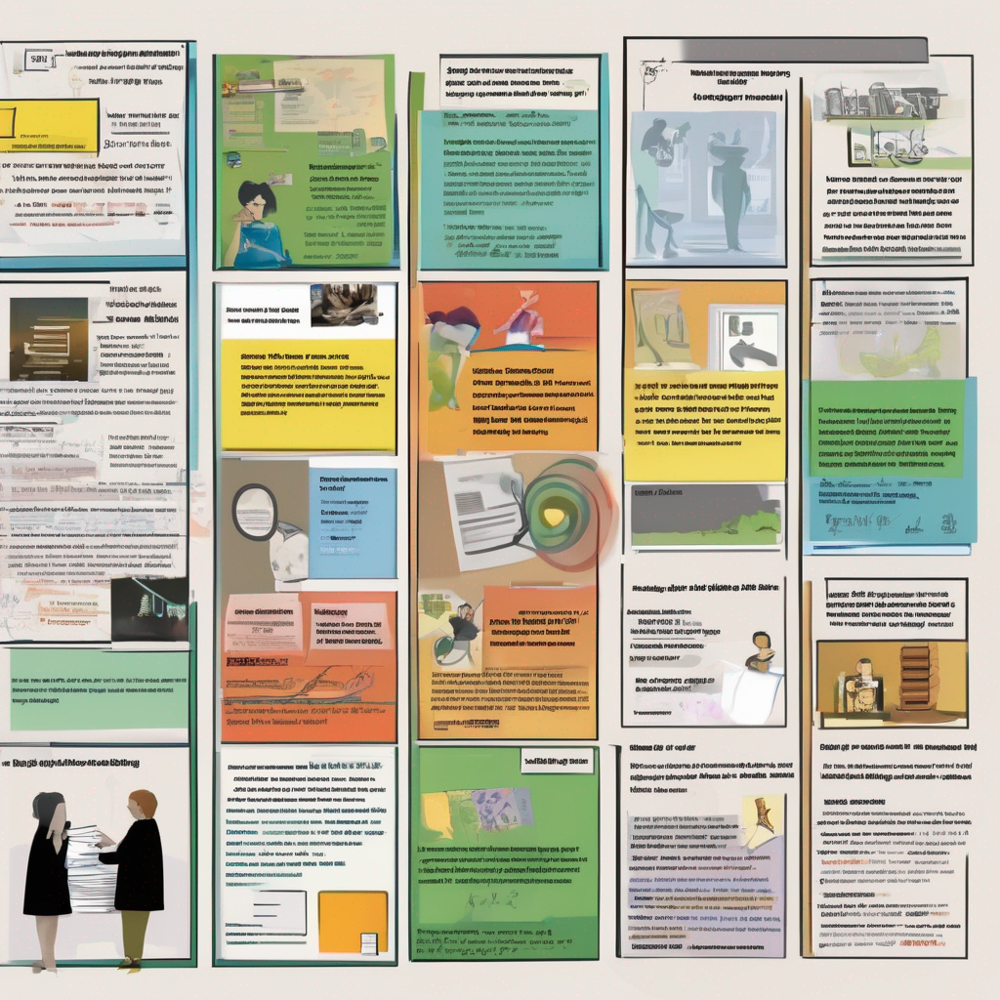

## Motywacja

Prosta sprawa, chciałem ogarnąć vitepress i trochę poznać web frontend.
Jak też, chciałbym zostawiać tu krótkie wpisy, głównie polecające treści, które mnie zainspirowały, wniosły coś wartościowego do mojego życia.
Zarówno jeśli chodzi o sprawy technicznie, jak i powiedzmy humanistyczne.

Bywa czasem, że poleciłbym komuś coś przeczytać, lub posłuchać, a nie zapamiętałem autora, nie ma czasu tego szukać itp.
A tak, byłoby wszystko w jednym miejscu.

## Czemu github?

Łatwo postawić stronę i jest za free ;)
A poza tym nie znam się innych rozwiązań, a to działa więc po co kombinować?
